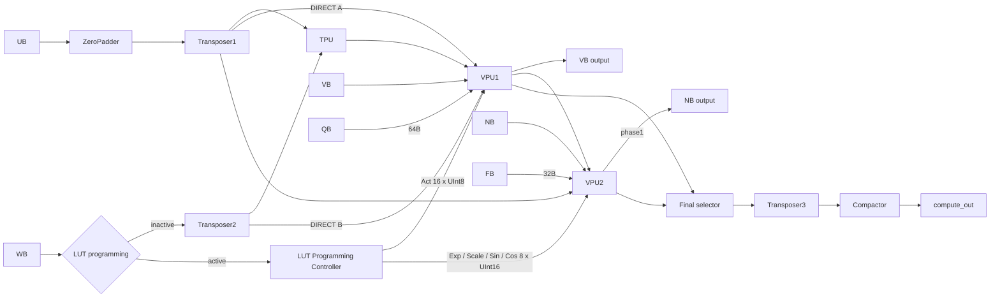

# Production ComputeUnit

`ComputeUnit`은 Central Control의 decoded control과 OCM stream을 받아 연결하는
datapath다. RoCC instruction decode, DMA 주소 생성, DRAM write mask, Stall Distributor는
포함하지 않는다. `TPU`, `GPALU`, Quant/Norm/RoPE의 산술과 LUT narrow-read latency는 유지한다.

## 변경 파일

| 파일 | 변경 |
| --- | --- |
| `src/main/scala/npu/top/Comp.scala` | ZP/Compactor/LUT controller 통합, 실제 transposer bypass, decoded enable/control 및 alert |
| `src/main/scala/npu/core/ZeroPadder.scala` | 기존 scalar/free-running 구현을 16-lane M=1 expansion으로 교체 |
| `src/main/scala/npu/core/Compactor.scala` | 기존 15-tile buffer를 online row0 extraction으로 교체 |
| `src/main/scala/npu/core/LutProgrammingController.scala` | WB 16B programming controller 신규 추가 |
| `src/main/scala/npu/top/VPU.scala` | 두 production stage의 LUT 기본 write 폭 128b |
| `src/main/scala/npu/core/{QuantActUnit,NormUnit,Rope}.scala` | generic LUT 기본 write 폭 128b; 산술 변경 없음 |
| `src/test/scala/{ZeroPadder,Compactor,LutProgrammingController,ComputeUnit}_Test.scala` | 새 focused/integration tests |
| `src/test/scala/{QuantAct,Rope,NormUnit,NormUnit_Distributed,NormUnit_Distributed_Debug,VPU1Route,VPU}_Test.scala` | 128b LUT programming 폭/주소/beat 수 반영 |
| `src/test/scala/{TPU,QuantAct,Rope,VPU1Route,NormUnit,NormUnit_Distributed}_Test.scala` | 기존 시나리오/검증을 유지하며 Verilator backend로 실행 |
| `Makefile` | 새 개별 test target, 전체 regression target, production source 목록, Verilator PCH 호환 옵션 |
| `docs/VPU1.md`, `docs/ComputeUnit.md` | interface 및 실행 계약 문서화 |

## 데이터 경로



ZP/TR1/TR2/TR3/Compactor는 각각 bypass 가능하다. Transposer bypass는 ComputeUnit의
combinational mux로 구현하며, 해당 child의 `in_valid`와 `out_stream_en`을 모두 끈다.
`PingPongTransposer.transpose=0`의 buffered row-read 동작은 변경하지 않는다.
Transpose를 활성화하면 16개 physical row를 채운 뒤 stream enable로 column을 읽는다.

VPU1 경로는 `TPU INT32 → QuantAct → GPALU(+VB)` 또는
`DIRECT UB/WB INT8 → GPALU forced ADD INT10 → activation only`다.
VPU2는 Normalizer와 RoPE의 조합이며 DISTRIBUTED layout에서는 RoPE를 bypass한다.
VPU1 route가 COMPUTE이면 final selector는 VPU1을, 나머지 route에서는 VPU2를 선택한다.
선택은 valid bubble 중에도 유지한다. 두 final source가 동시에 유효하면 control alert다.

MXU는 `X[M,K]`, `W[N,K]`에서 `Y[m,n]=dot(X[m,:],W[n,:])`를 계산한다.
즉 `Y=X*W^T`이며, MXU 내부에서 runtime transpose를 추가하는 의미가 아니다.

## Top-level IO

기존 세 개의 transpose Bool은 decoded `transpose_en_rd[1]`, `[0]`,
`transpose_en_wr`에 각각 대응한다. 다음 이름을 그대로 Central Control에서 연결한다.

| 구분 | Inputs | Outputs / 계약 |
| --- | --- | --- |
| OCM data | `ub_in`, `wb_in`, `vb_in`, `nb_in`: Vec(16, UInt8), 각각 `*_valid`: Bool | global stall을 따르는 16B beat |
| Shape/TPU | `tpu_en`, `tpu_input_tile_start`, `tpu_clear_w`: Bool; `tpu_interm_num`, `tpu_out_col_num`: UInt32 | `tpu_fusion_req`: Bool |
| Transpose | `ub_transpose_en`, `wb_transpose_en`, `output_transpose_en`: Bool | `ub_trans_ready`, `wb_trans_ready`, `comp_trans_ready`: bank write 가능, bypass이면 true |
| Transpose stream | `ub_stream_en`, `wb_stream_en`, `comp_stream_en`: Bool | transpose 활성화 시에만 사용 |
| M=1 compact | `vector_compact_in`, `vector_compact_out`: Bool | `zero_pad_busy`, `compactor_busy`: 현재 physical tile 미완료 |
| VPU1 routing | `vpu1_en`: Bool; `vpu1_input_mode`: UInt1; `vpu1_output_route`: UInt2 | `vpu1_busy`, `vb_req`: Bool |
| VPU1 operation | `vpu1_param_mode`: UInt1; `matrix_quant_param`: UInt32; `vpu1_act_mask`: UInt2; `vpu1_fusion_second`: Bool; `vpu1_alu_mode`: UInt2; `vpu1_out_shift`: UInt5 | 기존 fusion/quant 규약 유지 |
| QB | `qb_data`: Vec(16, UInt32), `qb_valid`: Bool | `qb_req`: 64B read request |
| VPU2 routing | `vpu2_en`: Bool; `vpu2_input_sel`: UInt2 (0 NB, 1 UB/TR1, 2 VPU1) | `nb_req`, `vpu2_rope_active`: Bool |
| Normalizer | `vpu2_norm_mode`: UInt2; `vpu2_norm_phase`: Bool; `vpu2_norm_layout`: UInt1; `norm_logical_vector_length`: UInt32; `norm_inv_vector_length`: UInt24; `norm_epsilon`: UInt32; `vpu2_clr_acc`: Bool | phase1 → NB; phase2 → RoPE |
| RoPE/FB | `vpu2_rope_en`, `rope_position_init`: Bool; `rope_base_m`: UInt32; `fb_data`: Vec(16, UInt16); `fb_valid`: Bool | `fb_req`: 32B read request |
| LUT programming | `lut_program_start`: Bool; `lut_write`: UInt5; payload는 `wb_in`/`wb_valid` | `lut_in_ready`, `lut_prog_busy`, `lut_prog_done`, `lut_prog_alert`: Bool |
| Outputs | — | `vb_out`, `nb_out`, `compute_out`: Vec(16, UInt8); 각 `*_valid`: Bool |
| Global/status | `stall`, `soft_reset`: Bool | `lut_ready`, `control_alert`, `fatal_alert`: Bool |

`tpu_en`, `vpu1_en`, `vpu2_en`은 입력 소비를 허용한다. 해당 unit을 통과하는 operation은
출력이 모두 drain될 때까지 enable과 설정을 유지해야 한다. TPU를 우회하는 DIRECT 작업은
`tpu_en=0`으로 설정하므로 동일 UB/WB stream을 TPU가 소비하지 않는다.
`tpu_input_tile_start`는 **TR1 이후 TPU 입력 stream의 row0**와 함께 공급한다.
UB에서 transpose tile을 채우는 시점의 metadata를 자동 지연시키는 포트가 아니다.

VB/QB/FB의 이미 요청된 synchronous response는 기존 hold 계약을 따른다.
특히 VB 공급자는 stall 중 도착한 응답을 GPALU가 소비할 때까지 보존해야 한다.
`soft_reset`은 ZP/Compactor/LUT controller와 기존 parameter scheduler를 초기화한다.
TPU/Normalizer/Transposer 전체 flush가 아니므로 정상 operation을 먼저 drain한다.

## Accepted-cycle state

외부 `stall`은 레지스터를 거치지 않고 TR1/TR2/TR3/ZP/Compactor/TPU/VPU1/VPU2 및
LUT controller로 fan-out된다. 모든 physical stream valid는 stall 중 억제된다.
이미 발행한 SRAM/LUT 응답을 보관하는 기존 동작은 유지한다.

ZeroPadder의 4-bit `row=0`은 idle/row0 상태다. compact input을 받는 cycle에 그대로
출력하고 `row=1`로 이동한다. `row=1..15`에서는 valid zero vector를 생성하고,
각 unstalled output edge마다 증가한 뒤 0으로 돌아온다. idle에서 valid가 없으면 정지한다.
padding 중 들어온 새 input은 현재 zero row를 덮지 않으며 `sync_alert`를 낸다.

Compactor의 4-bit `row`는 compact mode의 `in_valid && !stall`에서만 증가한다.
`row=0`만 output valid를 내고 나머지는 drop한다. 데이터 저장소는 없다.
두 모듈은 bypass 중 row state를 진행시키지 않는다. compact enable을 mid-tile에
바꾸면 alert이며, 정상적인 전환은 busy=false에서 한다.

## LUT controller

상태는 `IDLE → STREAM → WAIT_ACK → IDLE`이다.

- IDLE의 unstalled start에서 bitmap을 latch한다. 첫 payload는 다음 cycle부터 받는다.
- STREAM은 `wb_valid && lut_in_ready`일 때만 현재 target을 write하고 주소를 증가시킨다.
- 마지막 주소에서 다음 enabled target으로 이동하며 local address를 0으로 설정한다.
- 최종 write 뒤 WAIT_ACK를 거친다. LUT write ACK가 보이는 cycle을 지난 뒤 done을 낸다.
  WAIT_ACK 중 stall이면 완료를 보류하고 다음 unstalled edge에 보고한다.
- done은 한 clock pulse다. selection=0이면 payload를 받지 않고 start 다음 cycle에 done이다.
- busy 중 재시작은 무시하고 alert를 낸다. bitmap 변경은 진행 중인 task에 영향을 주지 않는다.

| Target | Bitmap bit | Geometry | 16B write 주소 | Beat 수 |
| --- | ---: | --- | --- | ---: |
| Act | 4 | 1024 x 8b | 0..63 | 64 |
| Exp | 3 | 256 x 16b | 0..31 | 32 |
| Scale | 2 | 256 x 16b | 0..31 | 32 |
| Sin | 1 | 1024 x 16b | 0..127 | 128 |
| Cos | 0 | 1024 x 16b | 0..127 | 128 |

항상 Act → Exp → Scale → Sin → Cos 순서이며 disabled table은 beat를 소비하지 않는다.
11111은 384 beat/6144B, 10101은 Act 64 + Scale 32 + Cos 128 = 224 beat다.
`wb_in(0)`은 bits[7:0]이다. Act는 16 byte를 그대로 받고 16-bit LUT는
`word[i] = Cat(wb_in(2*i+1), wb_in(2*i))`를 받는다.
기존 generic `Universal_Wide_LUT`과 narrow-read semantics는 그대로 사용한다.

LUT task는 compute path를 drain하고 세 compute enable과 일반 stream enable/valid를
내린 뒤 시작한다. start cycle부터 최종 ACK까지 WB의 normal route를 차단한다.
동시에 compute를 요청하면 `lut_prog_alert`를 내며 LUT payload도 backpressure한다.
busy가 false일 때 WB는 다시 normal route를 사용하므로 소스는 ready handshake로
선택 table의 정확한 payload 수만 보내야 한다. reprogramming도 별도 done을 사용한다.
`lut_ready = !programActive && vpu1.lut_ready && vpu2.lut_ready`다.

## Illegal controls

`control_alert`/`fatal_alert`에는 다음이 반영된다.

- `vector_compact_out && output_transpose_en`: M=1 row0 extraction과 transpose의 충돌.
- LUT programming 중 compute enable/stream 동시 요청 또는 busy 중 재시작.
- VPU1 busy 중 input mode/output route 변경: 기존 route를 유지하며 alert.
- 두 final source의 동시 valid, reserved `vpu2_input_sel=3`.
- ZP/Compactor mid-tile compact disable, ZP padding 중 새 compact input은 child sync alert.

## 검증 실행

```sh
make zero-padder-test compactor-test lut-program-test compute-unit-test
make vpu-stage-test tpu-test vpu1-tests quant-test rope-test
make norm-test norm-distributed-test param-ocm-test production-compile
# 전체 동일 순서 실행:
make compute-regression
```

각 target은 필요한 source만 compile한다. 기존 stale top/Sequencer는 포함하지 않는다.
로컬 sbt는 `RTL_SBT=sbt`로 지정한다. 같은 target 디렉터리의 sbt를 동시에 실행하지 않는다.
ComputeUnit smoke와 TPU/QuantAct/RoPE/VPU1 route/Normalizer 회귀는 회로 크기를 고려해
Verilator backend를 사용한다.
Docker 환경에는 Verilator가 설치되어 있으며 로컬 실행 시에도 필요하다.
Verilator 5.020과 chiseltest 6.0.0의 PCH 충돌을 피하기 위해 Makefile의 해당 target들만
`VK_PCH_I_FAST=`와 `VK_PCH_I_SLOW=`를 하위 C++ make에 전달한다. RTL은 변경하지 않는다.

새 focused tests는 compact bypass/다중 tile/random stall, LUT bitmap 5종과 모든
programmed entry의 실제 narrow-readback/commit/endianness를 검사한다. ComputeUnit smoke는
WB 독점 프로그래밍, DIRECT의 네 목적지, UB/NB→VPU2, compact 입출력, TPU `X*W^T`,
TR1/TR2/TR3의 실제 transpose 및 bypass, global stall, illegal-control alert를 확인한다.

### 실행 결과 (2026-09-12)

아래 target을 순차 실행했다. 테스트는 중복을 제외하면 35개이며,
`vpu1-tests`에 포함된 QuantAct 6개를 `quant-test`로 다시 실행하여 총 41회 통과했다.

| 명령 | 결과 |
| --- | --- |
| `make zero-padder-test` | 1/1 PASS |
| `make compactor-test` | 1/1 PASS |
| `make lut-program-test` | 1/1 PASS |
| `make compute-unit-test` | 1/1 PASS |
| `make vpu-stage-test` | 2/2 PASS |
| `make tpu-test` | 4/4 PASS |
| `make vpu1-tests` | 9/9 PASS (GPALU 1 + QuantAct 6 + route 2) |
| `make quant-test` | 6/6 PASS |
| `make rope-test` | 4/4 PASS |
| `make norm-test` | 3/3 PASS |
| `make norm-distributed-test` | 5/5 PASS |
| `make param-ocm-test` | 4/4 PASS |
| `make production-compile` | 19개 production Scala source compile PASS |
| `git diff --check` | PASS |

수정한 debug test의 LUT payload 폭도 128b로 맞췄지만, debug 전용 suite는 위 회귀에
포함하지 않았다. 요구된 production/focused suite가 검증 범위다.
